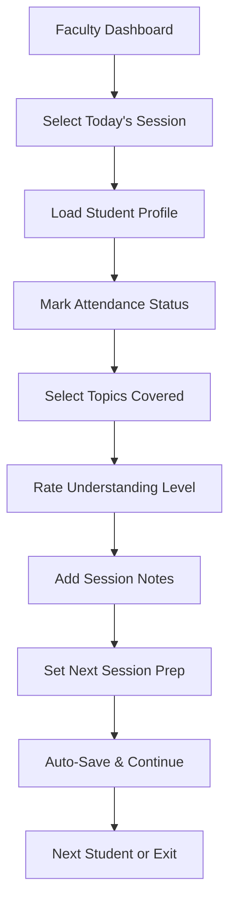

# Quick Topic-Tagged Attendance System Design

## Overview

This document outlines the design of an efficient attendance system that allows faculty to quickly mark attendance while simultaneously tracking topics taught during each session. The system is optimized for individual-focused learning with minimal friction for faculty.

## Key Design Principles

1. **Speed and Efficiency**: Minimize clicks and data entry for faculty
2. **Context-Aware**: Show relevant information based on student progress
3. **Mobile-Friendly**: Responsive design for tablet/mobile use
4. **Auto-Save**: Prevent data loss with automatic saving
5. **Batch Operations**: Handle multiple students efficiently when needed

## Interface Components

### 1. Quick Attendance Dashboard

#### Main Features:
- Today's scheduled sessions overview
- Quick access to pending attendance
- Student progress indicators
- Topic completion status

#### Layout:
```
┌─────────────────────────────────────────────────────────────┐
│ Today's Sessions - [Date]                                    │
├─────────────────────────────────────────────────────────────┤
│ ┌─────────────────┐ ┌─────────────────┐ ┌─────────────────┐ │
│ │ 9:00 AM - John  │ │ 10:30 AM - Sarah│ │ 2:00 PM - Mike  │ │
│ │ [Mark Attendance]│ │ [Mark Attendance]│ │ [Mark Attendance]│ │
│ │ Status: Pending │ │ Status: Pending │ │ Status: Pending │ │
│ └─────────────────┘ └─────────────────┘ └─────────────────┘ │
└─────────────────────────────────────────────────────────────┘
```

### 2. Attendance & Topic Marking Interface

#### Core Components:

##### Student Information Panel
```
┌─────────────────────────────────────────────────────────────┐
│ Student: John Doe | Subject: Python Programming             │
│ Progress: 65% Complete | Last Session: 2 days ago          │
│ Current Topic: Object-Oriented Programming                  │
└─────────────────────────────────────────────────────────────┘
```

##### Quick Attendance Section
```
┌─────────────────────────────────────────────────────────────┐
│ Session Attendance                                           │
├─────────────────────────────────────────────────────────────┤
│ ○ Present  ○ Absent  ○ Late                                 │
│ Check-in Time: [09:05]  Check-out Time: [10:45]             │
│ Session Duration: 100 minutes                               │
└─────────────────────────────────────────────────────────────┘
```

##### Topic Coverage Section
```
┌─────────────────────────────────────────────────────────────┐
│ Topics Covered                                               │
├─────────────────────────────────────────────────────────────┤
│ ✓ Classes and Objects (45 min) - Completed                 │
│ ✓ Inheritance (30 min) - Completed                         │
│ ○ Polymorphism (25 min) - In Progress                       │
│                                                             │
│ [+ Add New Topic]                                           │
│                                                             │
│ Topic Details:                                              │
│ ┌─────────────────────────────────────────────────────────┐ │
│ │ Topic: Polymorphism                                      │ │
│ │ Duration: 25 min                                         │ │
│ │ Understanding Level: ▓▓▓▓▓▓▓░░ 70%                      │ │
│ │ Notes: Student grasped basic concepts                    │ │
│ │ Next Session: Review with practical examples             │ │
│ └─────────────────────────────────────────────────────────┘ │
└─────────────────────────────────────────────────────────────┘
```

##### Quick Actions
```
┌─────────────────────────────────────────────────────────────┐
│ Quick Actions                                                │
├─────────────────────────────────────────────────────────────┤
│ [Mark All Present] [Save & Next] [Save & Exit]              │
│ [Schedule Follow-up] [Send Progress Update]                 │
└─────────────────────────────────────────────────────────────┘
```

### 3. Batch Attendance Mode (for occasional groups)

#### Interface:
```
┌─────────────────────────────────────────────────────────────┐
│ Batch: Python Basics Workshop | Date: [Current Date]        │
├─────────────────────────────────────────────────────────────┤
│ ┌─────────────────────────────────────────────────────────┐ │
│ │ Student Name        │ Status │ Topics Covered           │ │
│ ├─────────────────────────────────────────────────────────┤ │
│ │ John Doe           │ ✓ Present │ [Select Topics]        │ │
│ │ Sarah Smith        │ ✓ Present │ [Select Topics]        │ │
│ │ Mike Johnson       │ ○ Late    │ [Select Topics]        │ │
│ │ Emily Davis        │ ✓ Absent  │ N/A                    │ │
│ └─────────────────────────────────────────────────────────┘ │
│                                                             │
│ Common Topics Covered:                                       │
│ ✓ Introduction to Python                                    │
│ ✓ Variables and Data Types                                  │
│                                                             │
│ [Save All Attendance] [Add Notes for All]                   │
└─────────────────────────────────────────────────────────────┘
```

## Interaction Flow

### 1. Individual Session Attendance Flow



### 2. Quick Topic Selection

#### Smart Topic Suggestions:
- Based on student's current progress
- Prerequisite completion status
- Previously scheduled topics
- Faculty's teaching preferences

#### Topic Selection Interface:
```
┌─────────────────────────────────────────────────────────────┐
│ Select Topics Covered                                       │
├─────────────────────────────────────────────────────────────┤
│ 🔍 Search topics...                                         │
│                                                             │
│ Suggested Topics (based on progress):                      │
│ ✓ [✓] Classes and Objects (Next in syllabus)               │
│ ✓ [✓] Inheritance (Prerequisite completed)                │
│ ✓ [  ] Polymorphism (Ready to start)                       │
│                                                             │
│ All Available Topics:                                       │
│ ✓ [  ] Encapsulation                                        │
│ ✓ [  ] Abstraction                                          │
│ ✓ [  ] Interfaces                                           │
│                                                             │
│ [+ Create Custom Topic]                                     │
└─────────────────────────────────────────────────────────────┘
```

### 3. Understanding Level Assessment

#### Visual Rating System:
```
┌─────────────────────────────────────────────────────────────┐
│ Student Understanding Assessment                             │
├─────────────────────────────────────────────────────────────┤
│ Topic: Polymorphism                                         │
│                                                             │
│ Understanding Level:                                         │
│ ○ 1 - No Understanding                                      │
│ ○ 2 - Basic Awareness                                       │
│ ○ 3 - Partial Understanding                                 │
│ ● 4 - Good Understanding                                    │
│ ○ 5 - Complete Mastery                                      │
│                                                             │
│ Quick Notes:                                                │
│ ┌─────────────────────────────────────────────────────────┐ │
│ │ Student understood concepts well but needs practice     │ │
│ │ with real-world examples                                 │ │
│ └─────────────────────────────────────────────────────────┘ │
│                                                             │
│ Follow-up Required: ☑ Yes  ○ No                            │
│ Next Session Focus: Practical implementation                │
└─────────────────────────────────────────────────────────────┘
```

## Mobile-First Design Considerations

### 1. Touch-Friendly Interface
- Large tap targets (minimum 44px)
- Swipe gestures for navigation
- Voice input support for notes

### 2. Offline Capability
- Local storage for pending attendance
- Sync when connection restored
- Conflict resolution interface

### 3. Quick Actions Bar
```
┌─────────────────────────────────────────────────────────────┐
│ [👤 Present] [❌ Absent] [⏰ Late] [📝 Notes] [💾 Save]      │
└─────────────────────────────────────────────────────────────┘
```

## Automation Features

### 1. Smart Defaults
- Pre-select attendance based on check-in times
- Suggest topics based on syllabus progress
- Auto-calculate session duration

### 2. Quick Templates
- Common topic combinations
- Standard session notes
- Frequently used feedback

### 3. Bulk Operations
- Mark multiple students present
- Apply same topics to group sessions
- Send batch notifications

## Integration Points

### 1. Calendar Integration
- Session scheduling
- Reminder notifications
- Availability checking

### 2. Progress Tracking
- Automatic progress updates
- Competency level adjustments
- Completion percentage calculations

### 3. Notification System
- Absentee alerts
- Progress milestones
- Follow-up reminders

## Performance Optimizations

### 1. Lazy Loading
- Load student data on demand
- Progressive topic loading
- Infinite scroll for history

### 2. Caching Strategy
- Cache student progress data
- Store frequently used topics
- Preload upcoming sessions

### 3. Minimal Data Entry
- Auto-complete for topics
- Keyboard shortcuts
- Voice-to-text for notes

This attendance system design prioritizes speed and efficiency while maintaining comprehensive tracking of both attendance and topic coverage, enabling faculty to focus on teaching rather than administrative tasks.