# Data Flow Diagrams for Individual-Focused Learning System

## Overview

This document outlines comprehensive data flow diagrams that illustrate how information moves through the individual-focused learning management system. The diagrams cover major workflows including student enrollment, attendance tracking, progress monitoring, and analytics processing.

## System Architecture Data Flow

### High-Level System Data Flow

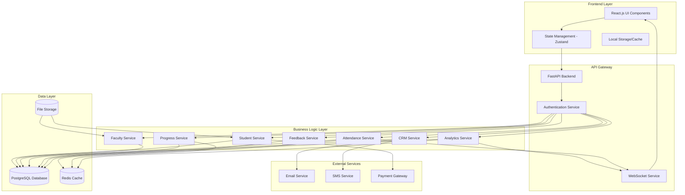

## Student Enrollment Data Flow

### Student Registration and Onboarding

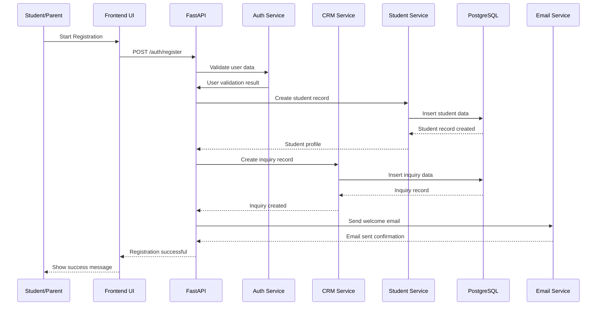

### Subject Enrollment and Faculty Assignment

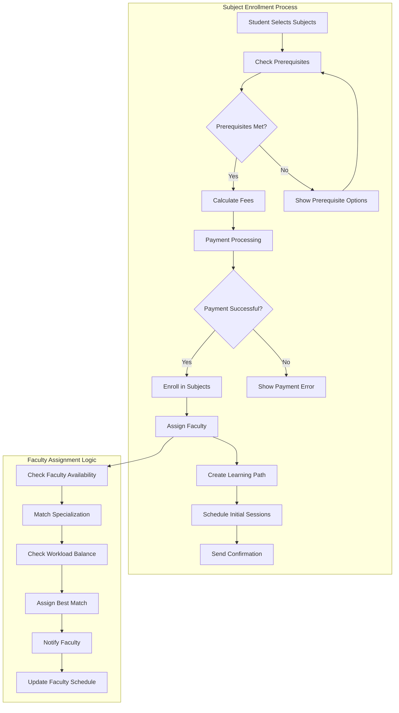

## Attendance System Data Flow

### Real-Time Attendance Marking

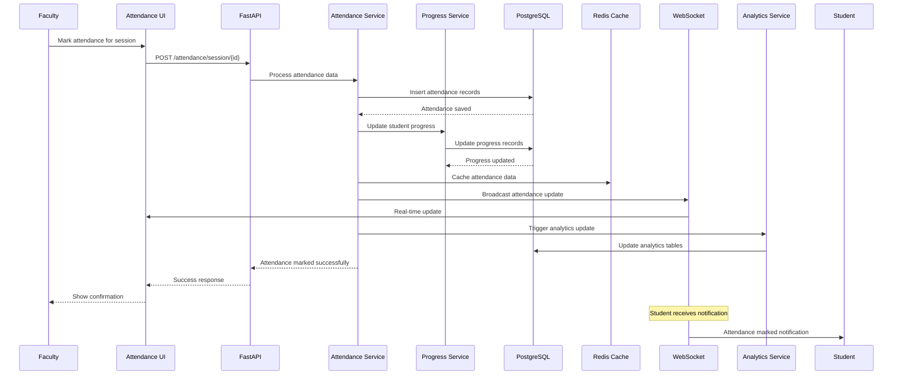

### Topic Coverage and Competency Tracking

```mermaid
graph LR
    subgraph "Attendance Marking"
        A[Session Start] --> B[Mark Attendance]
        B --> C[Select Topics Covered]
        C --> D[Rate Understanding Level]
        D --> E[Add Session Notes]
        E --> F[Save Attendance]
    end
    
    subgraph "Progress Update"
        F --> G[Update Topic Progress]
        G --> H[Calculate Competency Level]
        H --> I[Update Subject Progress]
        I --> J[Calculate Learning Velocity]
        J --> K[Predict Completion Date]
    end
    
    subgraph "Analytics Processing"
        K --> L[Update Student Analytics]
        L --> M[Update Faculty Performance]
        M --> N[Update Institute Metrics]
        N --> O[Generate Reports]
    end
    
    subgraph "Notifications"
        O --> P[Send Progress Updates]
        P --> Q[Trigger Alerts if Needed]
        Q --> R[Schedule Follow-ups]
    end
```

## Student Progress Analytics Data Flow

### Real-Time Progress Calculation

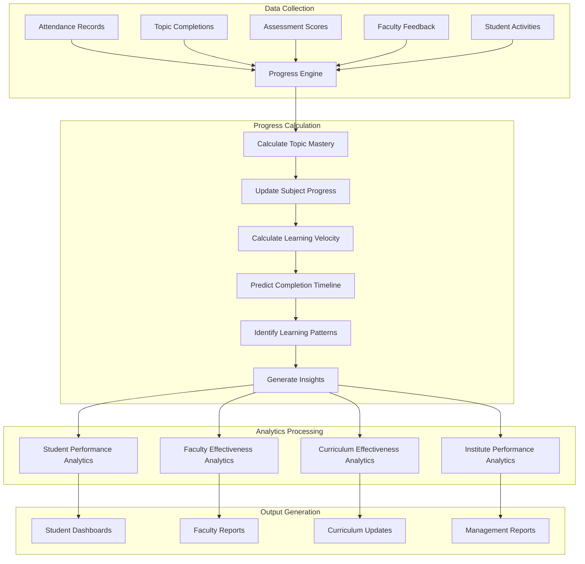

### Predictive Analytics Pipeline

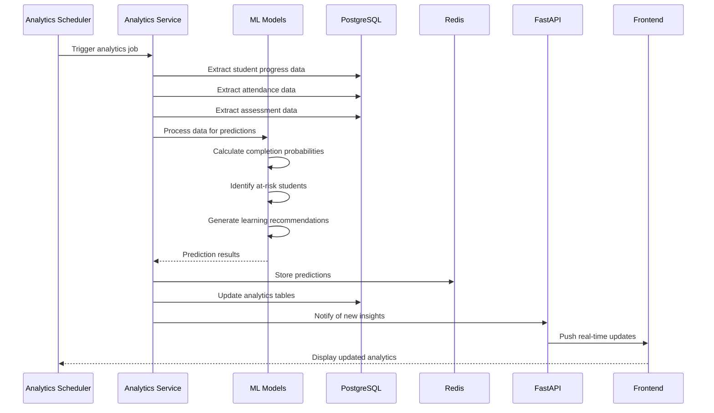

## CRM System Data Flow

### Lead Management and Conversion

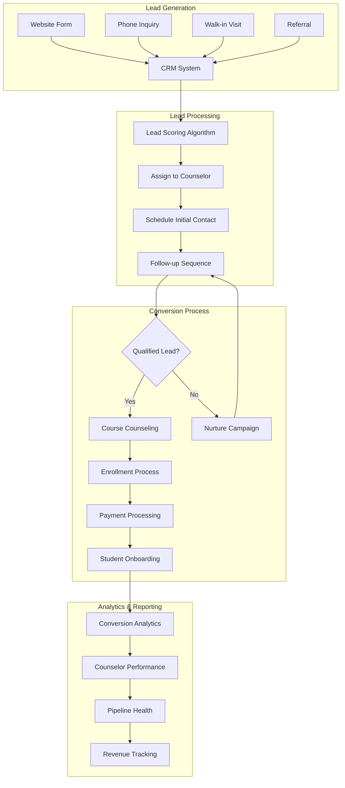

### Follow-up Automation Flow

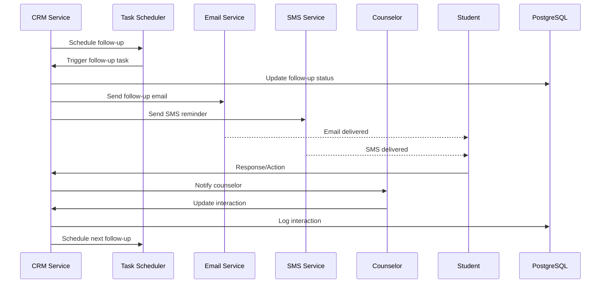

## Feedback System Data Flow

### Multi-Channel Feedback Collection

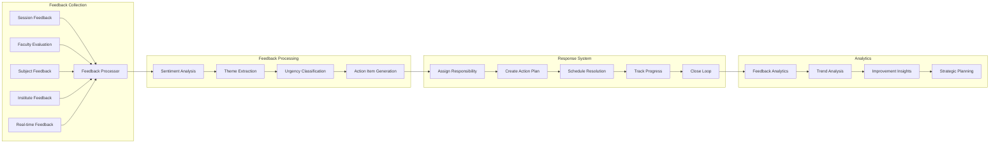

## Faculty Management Data Flow

### Performance Tracking and Analytics

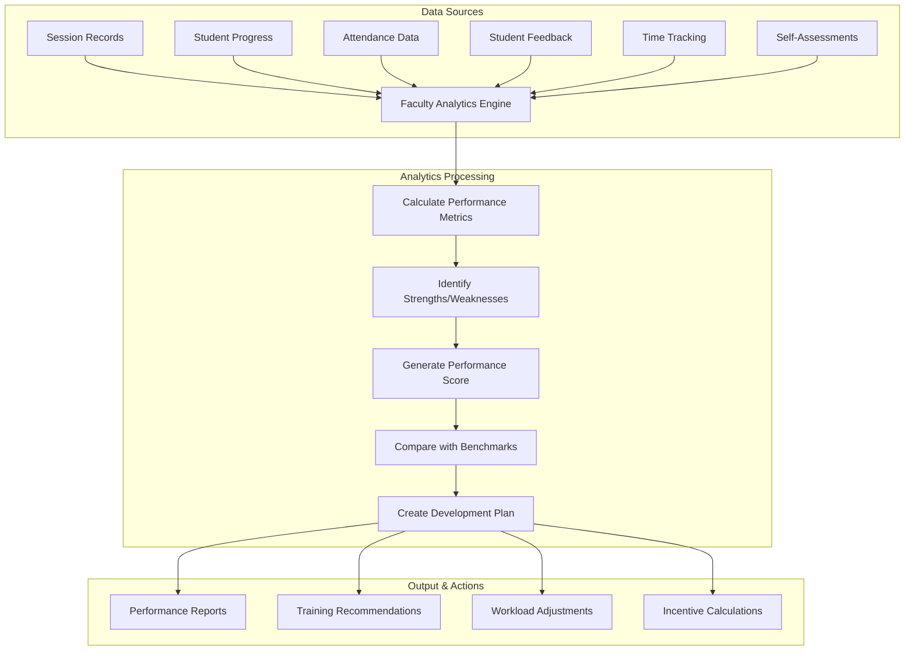

## Real-Time Data Synchronization

### WebSocket Communication Flow

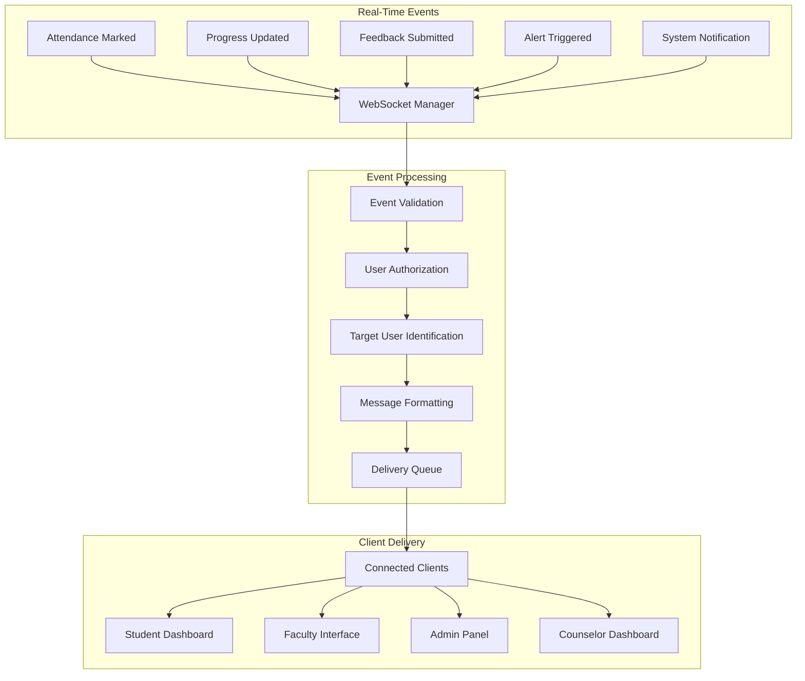

## Data Integration and ETL

### Batch Processing Pipeline

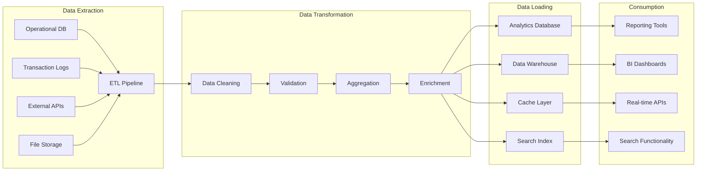

## Data Security and Privacy Flow

### Data Access Control

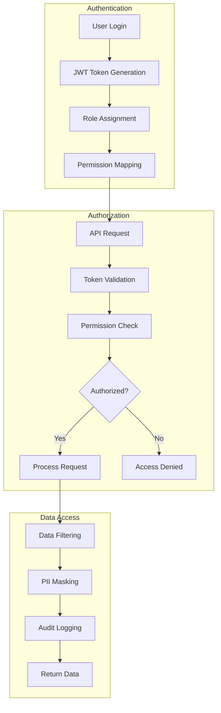

These data flow diagrams provide a comprehensive view of how information moves through the individual-focused learning management system, ensuring clear understanding of system interactions and data processing pipelines.