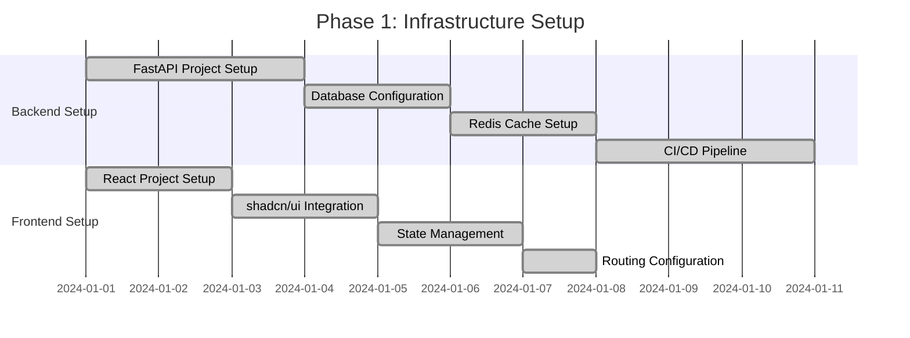
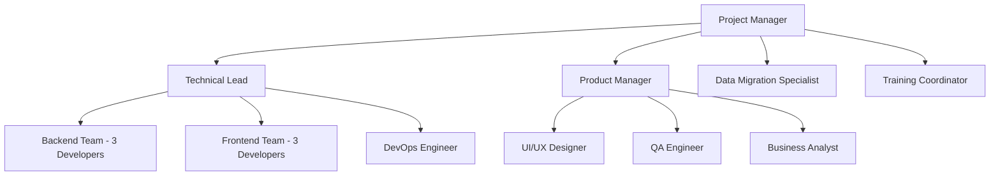

# Implementation Roadmap for Individual-Focused Learning Management System

## Overview

This document outlines a comprehensive implementation roadmap for transitioning from the current Laravel/Vue.js system to a modern FastAPI/React.js individual-focused learning management system. The roadmap is structured in phases to ensure smooth transition, minimal disruption, and incremental value delivery.

## Implementation Strategy

### Guiding Principles
1. **Incremental Delivery**: Release features in phases for early value realization
2. **Parallel Development**: Run new system alongside existing during transition
3. **User-Centric Approach**: Prioritize features based on user impact and frequency
4. **Data Integrity**: Ensure seamless data migration without loss
5. **Change Management**: Comprehensive training and support for all stakeholders

### Success Metrics
- User adoption rate > 90% within 3 months
- Reduction in administrative time by 40%
- Improvement in student progress tracking accuracy by 60%
- Increase in counselor conversion rate by 25%
- System uptime > 99.5%
- User satisfaction score > 4.5/5

## Phase 1: Foundation and Core Infrastructure (Weeks 1-6)

### Objectives
- Establish development infrastructure
- Implement core authentication and user management
- Set up database and basic data models
- Create foundational UI components

### Technical Implementation

#### Week 1-2: Infrastructure Setup

**Deliverables:**
- FastAPI backend with basic structure
- PostgreSQL database with initial schema
- Redis caching layer
- React frontend with shadcn/ui components
- Basic authentication system
- Development and staging environments

#### Week 3-4: Core User Management
**Backend Tasks:**
- Implement JWT authentication with refresh tokens
- Create user management APIs
- Set up role-based access control
- Implement password reset functionality

**Frontend Tasks:**
- Create login/register components
- Implement role-based routing
- Build user profile management
- Set up authentication guards

#### Week 5-6: Basic Data Models
**Database Schema:**
- Users, Students, Faculties tables
- Basic Subjects and Topics structure
- Simple attendance tracking
- Initial progress tracking

**API Endpoints:**
- User CRUD operations
- Basic student/faculty management
- Simple attendance marking
- Basic progress retrieval

### Acceptance Criteria
- [ ] Users can register, login, and manage profiles
- [ ] Role-based access control functioning
- [ ] Basic student and faculty data management
- [ ] Simple attendance marking capability
- [ ] Responsive design working on mobile devices

## Phase 2: Individual Learning Core (Weeks 7-12)

### Objectives
- Implement individual-focused learning features
- Build quick attendance system with topic tagging
- Create student progress tracking
- Develop faculty session management

### Technical Implementation

#### Week 7-8: Enhanced Data Models
**Database Enhancements:**
- Learning Sessions table
- Session Attendance with topic tracking
- Student Topic Progress table
- Flexible Batches support

**Key Features:**
- Individual session scheduling
- Topic-wise progress tracking
- Competency level assessment
- Learning path creation

#### Week 9-10: Quick Attendance System
**Attendance Features:**
- Individual student attendance marking
- Topic selection with smart suggestions
- Understanding level assessment (1-5)
- Session notes and next preparation
- Bulk operations for flexible batches

**UI Components:**
- Quick attendance interface
- Topic selector with search
- Understanding level rating
- Session notes editor
- Bulk actions panel

#### Week 11-12: Progress Tracking
**Progress Features:**
- Real-time progress calculation
- Topic completion tracking
- Learning velocity analysis
- Competency development monitoring
- Predictive completion modeling

**Analytics Dashboard:**
- Student progress overview
- Topic-wise mastery visualization
- Learning velocity trends
- Performance comparisons

### Acceptance Criteria
- [ ] Faculty can mark attendance with topic tagging
- [ ] Individual student progress tracking functional
- [ ] Real-time progress updates working
- [ ] Topic competency assessment implemented
- [ ] Basic analytics dashboards operational

## Phase 3: Advanced Analytics and CRM (Weeks 13-18)

### Objectives
- Implement comprehensive analytics system
- Build CRM module for counselors
- Create feedback system
- Develop reporting capabilities

### Technical Implementation

#### Week 13-14: Analytics Engine
**Analytics Features:**
- Student performance analytics
- Faculty utilization tracking
- Learning pattern recognition
- Predictive analytics models
- At-risk student identification

**Data Processing:**
- Real-time analytics pipeline
- Batch processing for historical data
- Machine learning model integration
- Performance metrics calculation

#### Week 15-16: CRM Module
**CRM Features:**
- Lead management and scoring
- Follow-up scheduling and tracking
- Conversion funnel analytics
- Counselor performance tracking
- Communication history

**CRM Components:**
- Inquiry management interface
- Lead scoring dashboard
- Follow-up scheduler
- Conversion analytics
- Performance reports

#### Week 17-18: Feedback System
**Feedback Features:**
- Multi-channel feedback collection
- Sentiment analysis and processing
- Action item generation
- Closed-loop resolution tracking
- Anonymous feedback options

**Feedback Components:**
- Session feedback forms
- Faculty evaluation system
- Subject feedback collection
- Institute feedback portal
- Feedback analytics dashboard

### Acceptance Criteria
- [ ] Comprehensive analytics dashboards functional
- [ ] CRM module fully operational
- [ ] Feedback collection and processing working
- [ ] Automated report generation implemented
- [ ] Predictive analytics providing insights

## Phase 4: Advanced Features and Integration (Weeks 19-24)

### Objectives
- Implement advanced features
- Integrate external systems
- Optimize performance
- Enhance user experience

### Technical Implementation

#### Week 19-20: Advanced Features
**Advanced Learning Features:**
- Personalized learning paths
- Adaptive difficulty adjustment
- Peer learning opportunities
- Gamification elements
- Mobile app support

**Faculty Features:**
- Advanced time tracking
- Performance optimization suggestions
- Resource recommendation engine
- Automated scheduling
- Burnout prevention alerts

#### Week 21-22: System Integration
**External Integrations:**
- Email service integration
- SMS gateway setup
- Payment gateway integration
- Calendar synchronization
- Video conferencing integration

**API Integrations:**
- Third-party learning tools
- External assessment platforms
- Analytics services
- Communication platforms

#### Week 23-24: Performance Optimization
**Optimization Areas:**
- Database query optimization
- Caching strategy enhancement
- Frontend performance tuning
- API response time improvement
- Mobile app optimization

**Monitoring & Security:**
- Comprehensive monitoring setup
- Security audit and hardening
- Performance benchmarking
- Load testing implementation
- Backup and recovery testing

### Acceptance Criteria
- [ ] Advanced learning features operational
- [ ] External integrations working smoothly
- [ ] System performance optimized
- [ ] Mobile app fully functional
- [ ] Security and monitoring comprehensive

## Phase 5: Data Migration and Go-Live (Weeks 25-28)

### Objectives
- Migrate existing data to new system
- Conduct comprehensive testing
- Train users on new system
- Execute go-live strategy

### Technical Implementation

#### Week 25-26: Data Migration
**Migration Strategy:**
- Data analysis and mapping
- Migration scripts development
- Data validation and cleanup
- Test migration execution
- Rollback planning

**Data Areas:**
- User accounts and profiles
- Student enrollment data
- Historical attendance records
- Academic progress data
- CRM and inquiry data

#### Week 27: Testing and Quality Assurance
**Testing Activities:**
- End-to-end system testing
- Performance testing
- Security testing
- User acceptance testing
- Integration testing

**Quality Assurance:**
- Code review and optimization
- Documentation completion
- Bug fixing and refinement
- Performance tuning
- Security validation

#### Week 28: Go-Live Preparation
**Go-Live Activities:**
- Production deployment
- User training sessions
- Support team preparation
- Communication plan execution
- Monitoring setup

**Support Structure:**
- Help desk setup
- User documentation
- Training materials
- Support protocols
- Escalation procedures

### Acceptance Criteria
- [ ] All data successfully migrated
- [ ] Comprehensive testing completed
- [ ] Users trained and confident
- [ ] Support structure operational
- [ ] Go-live executed smoothly

## Phase 6: Post-Launch Optimization (Weeks 29-36)

### Objectives
- Monitor system performance
- Gather user feedback
- Implement improvements
- Plan future enhancements

### Technical Implementation

#### Week 29-32: Monitoring and Feedback
**Monitoring Activities:**
- System performance monitoring
- User behavior analysis
- Error tracking and resolution
- Performance optimization
- Capacity planning

**Feedback Collection:**
- User satisfaction surveys
- Feature usage analytics
- Performance metrics review
- Support ticket analysis
- Improvement suggestions

#### Week 33-36: Continuous Improvement
**Improvement Areas:**
- Feature enhancements based on feedback
- Performance optimizations
- User experience improvements
- Additional integrations
- Advanced analytics capabilities

**Future Planning:**
- Technology roadmap development
- Feature prioritization
- Resource planning
- Budget considerations
- Timeline for next phase

### Acceptance Criteria
- [ ] System performance meeting targets
- [ ] User satisfaction high
- [ ] Continuous improvement process established
- [ ] Future roadmap defined
- [ ] ROI objectives achieved

## Resource Planning

### Team Structure

### Budget Allocation
| Category | Percentage | Description |
|----------|------------|-------------|
| Development | 60% | Backend and frontend development |
| Infrastructure | 15% | Servers, databases, and cloud services |
| Training | 10% | User training and change management |
| Testing & QA | 10% | Quality assurance and testing |
| Contingency | 5% | Buffer for unexpected costs |

## Risk Management

### High-Risk Areas
1. **Data Migration Complexity**
   - Risk: Data loss or corruption during migration
   - Mitigation: Comprehensive testing, backup strategies, rollback plans

2. **User Adoption Resistance**
   - Risk: Users resisting new system
   - Mitigation: Comprehensive training, change management, gradual transition

3. **Performance Issues**
   - Risk: System not meeting performance requirements
   - Mitigation: Load testing, optimization, scalable architecture

4. **Integration Challenges**
   - Risk: Third-party integrations failing
   - Mitigation: Thorough testing, fallback options, vendor support

### Contingency Plans
- Parallel system run during transition period
- Extended support during go-live phase
- Additional training sessions if needed
- Rollback procedures for critical issues

## Success Metrics and KPIs

### Technical Metrics
- System uptime: >99.5%
- API response time: <200ms
- Page load time: <3 seconds
- Database query performance: <100ms
- Mobile app performance: >4.5/5 rating

### Business Metrics
- User adoption rate: >90% within 3 months
- Administrative time reduction: >40%
- Student progress accuracy: >95%
- Counselor conversion improvement: >25%
- User satisfaction score: >4.5/5

### Operational Metrics
- Support ticket reduction: >30%
- Training completion rate: >95%
- Data migration accuracy: >99.9%
- Feature utilization rate: >80%
- System error rate: <0.1%

## Conclusion

This implementation roadmap provides a structured approach to transitioning to an individual-focused learning management system while minimizing disruption and maximizing value delivery. The phased approach allows for incremental improvements, risk mitigation, and continuous user feedback incorporation.

The success of this implementation depends on strong project management, user engagement, and technical excellence. Regular progress reviews, adaptive planning, and responsive change management will ensure the project meets its objectives and delivers significant value to all stakeholders.

The final system will provide a modern, efficient, and user-friendly platform that supports individualized learning experiences while maintaining operational excellence and data-driven decision making capabilities.