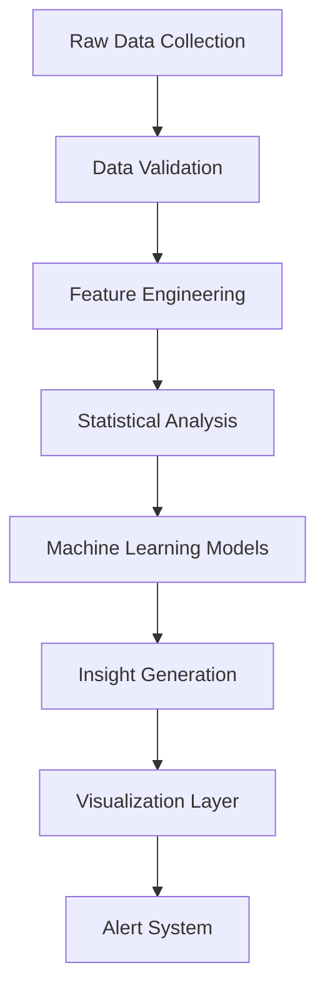

# Detailed Student Progress Analytics Architecture

## Overview

This document outlines the comprehensive analytics architecture for tracking individual student progress, identifying learning patterns, and providing actionable insights for students, faculty, and management.

## Analytics Objectives

1. **Individual Progress Tracking**: Monitor topic-level mastery and competency development
2. **Learning Pattern Recognition**: Identify strengths, weaknesses, and learning behaviors
3. **Predictive Analytics**: Forecast completion timelines and potential challenges
4. **Performance Benchmarking**: Compare progress against peers and standards
5. **Intervention Alerts**: Flag students needing additional support

## Data Collection Points

### 1. Session-Based Data
- Attendance patterns and consistency
- Topic coverage and duration
- Understanding level assessments
- Faculty observations and notes

### 2. Assessment Data
- Quiz and test scores
- Assignment completion rates
- Practical project evaluations
- Topic-specific competency levels

### 3. Behavioral Data
- Learning session frequency
- Preferred learning times
- Topic retry patterns
- Help-seeking behavior

### 4. Engagement Metrics
- Session participation levels
- Question asking frequency
- Resource utilization
- Feedback responsiveness

## Analytics Components

### 1. Progress Dashboard

#### Student Progress Overview
```
┌─────────────────────────────────────────────────────────────┐
│ Student Progress Dashboard - John Doe                       │
├─────────────────────────────────────────────────────────────┤
│ Overall Progress: 68% Complete | On Track: ⚠️ Slightly Behind │
│                                                             │
│ ┌─────────────────┐ ┌─────────────────┐ ┌─────────────────┐ │
│ │ Python          │ │ JavaScript      │ │ Data Structures│ │
│ │ 85% Complete    │ │ 72% Complete    │ │ 45% Complete    │ │
│ │ On Track ✓      │ │ On Track ✓      │ │ Behind ⚠️       │ │
│ └─────────────────┘ └─────────────────┘ └─────────────────┘ │
│                                                             │
│ Recent Activity:                                             │
│ • Completed: OOP Concepts (Python) - 92% understanding     │
│ • In Progress: Async Programming (JS) - 75% understanding   │
│ • Struggling: Recursion (DS) - 45% understanding           │
└─────────────────────────────────────────────────────────────┘
```

#### Topic-Level Progress Detail
```
┌─────────────────────────────────────────────────────────────┐
│ Subject: Python Programming - Topic Progress                │
├─────────────────────────────────────────────────────────────┤
│ ┌─────────────────────────────────────────────────────────┐ │
│ │ Topic                    │ Status    │ Competency │ Time │ │
│ ├─────────────────────────────────────────────────────────┤ │
│ │ Variables & Data Types   │ ✓ Mastered│ 95%        │ 2h   │ │
│ │ Control Structures       │ ✓ Mastered│ 88%        │ 3h   │
│ │ Functions                │ ✓ Mastered│ 85%        │ 4h   │
│ │ Classes & Objects        │ → Active  │ 78%        │ 3h   │ │
│ │ Inheritance              │ → Active  │ 72%        │ 2h   │ │
│ │ Polymorphism             │ ⚠️ Struggling│ 45%     │ 1h   │ │
│ │ File Handling            │ ○ Not Started│ 0%      │ 0h   │ │
│ └─────────────────────────────────────────────────────────┘ │
│                                                             │
│ Learning Velocity: 2.3 topics/week (Target: 2 topics/week) │
│ Estimated Completion: 3 weeks (Original: 2 weeks)          │
└─────────────────────────────────────────────────────────────┘
```

### 2. Learning Pattern Analysis

#### Learning Velocity Chart
```
┌─────────────────────────────────────────────────────────────┐
│ Learning Velocity Trends                                     │
├─────────────────────────────────────────────────────────────┤
│ Topics/Week                                                 │
│ 4 ┤                                                         │
│ 3 ┤     ●●●                                                 │
│ 2 ┤   ●●   ●●●    ●●●                                       │
│ 1 ┤ ●●       ●●●●●●●●●●●●●●●●                               │
│ 0 └─────────────────────────────────────────────────────────│
│   Jan   Feb   Mar   Apr   May   Jun   Jul   Aug   Sep   Oct │
│                                                             │
│ Average: 2.3 topics/week | Target: 2.0 topics/week          │
│ Trend: ↗ Increasing (15% improvement over last month)       │
└─────────────────────────────────────────────────────────────┘
```

#### Competency Development Heatmap
```
┌─────────────────────────────────────────────────────────────┐
│ Competency Development by Topic Area                         │
├─────────────────────────────────────────────────────────────┤
│ Topic Area         │ Week 1 │ Week 2 │ Week 3 │ Week 4 │ Trend │
├─────────────────────────────────────────────────────────────┤
│ Basic Concepts     │ ████   │ █████  │ █████  │ █████  │ ↗     │
│ Control Flow       │ ███    │ ████   │ █████  │ █████  │ ↗     │
│ Functions          │ ██     │ ███    │ ████   │ █████  │ ↗     │
│ OOP Concepts       │ █      │ ██     │ ███    │ ████   │ ↗     │
│ Advanced Topics    │        │ █      │ ██     │ ███    │ ↗     │
└─────────────────────────────────────────────────────────────┘
```

### 3. Predictive Analytics

#### Completion Forecast
```
┌─────────────────────────────────────────────────────────────┐
│ Completion Prediction Model                                   │
├─────────────────────────────────────────────────────────────┤
│ Current Progress: 68% Complete                               │
│                                                             │
│ Predicted Completion Scenarios:                             │
│ ┌─────────────────────────────────────────────────────────┐ │
│ │ Scenario        │ Completion Date │ Confidence │ Factors │ │
│ ├─────────────────────────────────────────────────────────┤ │
│ │ Current Pace    │ Dec 15, 2023   │ 85%        │ ✓      │ │
│ │ Optimistic      │ Nov 30, 2023   │ 60%        │ ⚠️     │ │
│ │ Conservative    │ Jan 10, 2024   │ 95%        │ ✓      │ │
│ └─────────────────────────────────────────────────────────┘ │
│                                                             │
│ Risk Factors:                                               │
│ ⚠️ Struggling with advanced topics (Polymorphism: 45%)      │
│ ⚠️ Irregular attendance pattern (3 absences in 2 weeks)    │
│ ✓ Strong foundation in basic concepts (avg: 90%)           │
│ ✓ Good faculty feedback scores (avg: 4.2/5)                │
└─────────────────────────────────────────────────────────────┘
```

#### Intervention Recommendations
```
┌─────────────────────────────────────────────────────────────┐
│ Recommended Interventions                                    │
├─────────────────────────────────────────────────────────────┤
│ High Priority:                                              │
│ 🔴 Additional practice sessions for Polymorphism concepts   │
│ 🔴 Review of recursive algorithms in Data Structures        │
│                                                             │
│ Medium Priority:                                            │
│ 🟡 Peer learning session for advanced OOP concepts          │
│ 🟡 Supplementary video materials for async programming      │
│                                                             │
│ Positive Reinforcements:                                    │
│ 🟢 Acknowledge progress in JavaScript fundamentals           │
│ 🟢 Encourage consistent attendance pattern                   │
└─────────────────────────────────────────────────────────────┘
```

### 4. Comparative Analytics

#### Peer Benchmarking
```
┌─────────────────────────────────────────────────────────────┐
│ Performance Comparison - Python Programming                  │
├─────────────────────────────────────────────────────────────┤
│ ┌─────────────────────────────────────────────────────────┐ │
│ │ Metric              │ Student │ Class Avg │ Top 10%    │ │
│ ├─────────────────────────────────────────────────────────┤ │
│ │ Overall Progress    │ 68%     │ 65%       │ 85%        │ │
│ │ Topics/Week        │ 2.3     │ 2.1       │ 3.2        │ │
│ │ Avg Competency      │ 76%     │ 72%       │ 92%        │ │
│ │ Attendance Rate     │ 92%     │ 88%       │ 98%        │ │
│ │ Assessment Score    │ 82%     │ 78%       │ 95%        │ │
│ └─────────────────────────────────────────────────────────┘ │
│                                                             │
│ Performance Percentile: 72nd percentile (Above Average)    │
│ Strengths: Consistent attendance, strong fundamentals       │
│ Areas for Improvement: Advanced topics, learning speed    │
└─────────────────────────────────────────────────────────────┘
```

### 5. Learning Style Adaptation

#### Personalized Learning Insights
```
┌─────────────────────────────────────────────────────────────┐
│ Learning Style Analysis                                      │
├─────────────────────────────────────────────────────────────┤
│ Dominant Learning Style: Visual + Kinesthetic               │
│                                                             │
│ Optimal Learning Conditions:                                │
│ ✓ Morning sessions (9-11 AM): 23% higher comprehension     │
│ ✓ 45-minute sessions: Better retention than 90-minute       │
│ ✓ Practical examples: 35% better understanding             │
│ ✓ Visual aids: Charts and diagrams improve retention        │
│                                                             │
│ Recommended Adjustments:                                    │
│ • Schedule complex topics in morning slots                  │
│ • Include more hands-on coding exercises                    │
│ • Use visual representations for abstract concepts          │
│ • Break advanced topics into smaller modules                │
└─────────────────────────────────────────────────────────────┘
```

## Technical Implementation

### 1. Data Processing Pipeline



### 2. Analytics Models

#### Progress Calculation Model
```python
def calculate_progress_weighted(student_id, subject_id):
    # Weight topics by difficulty and importance
    topic_weights = {
        'basic': 1.0,
        'intermediate': 1.5,
        'advanced': 2.0
    }
    
    # Calculate weighted completion
    completed_weight = sum(
        topic_weights[topic.difficulty] * competency_level
        for topic in completed_topics
    )
    
    total_weight = sum(
        topic_weights[topic.difficulty] * 5  # Max competency is 5
        for topic in all_topics
    )
    
    return (completed_weight / total_weight) * 100
```

#### Learning Velocity Model
```python
def calculate_learning_velocity(student_id, time_window_days=30):
    recent_sessions = get_sessions_in_window(student_id, time_window_days)
    topics_completed = count_completed_topics(recent_sessions)
    
    # Adjust for difficulty and session quality
    velocity_adjustment = calculate_quality_factor(recent_sessions)
    
    return (topics_completed / time_window_days) * 7 * velocity_adjustment
```

#### Predictive Completion Model
```python
def predict_completion_date(student_id, subject_id):
    current_progress = get_current_progress(student_id, subject_id)
    learning_velocity = calculate_learning_velocity(student_id)
    remaining_topics = get_remaining_topics(student_id, subject_id)
    
    # Factor in difficulty increase
    difficulty_factor = calculate_difficulty_progression(remaining_topics)
    
    estimated_days = (remaining_topics / learning_velocity) * difficulty_factor
    
    return current_date + timedelta(days=estimated_days)
```

### 3. Real-Time Analytics

#### Streaming Data Processing
- Session attendance updates
- Topic completion events
- Assessment results
- Faculty feedback

#### Alert Triggers
- Attendance threshold breaches
- Competency level drops
- Learning velocity changes
- At-risk student identification

### 4. Reporting Interfaces

#### Student-Facing Reports
- Weekly progress summaries
- Achievement milestones
- Personalized recommendations
- Learning path adjustments

#### Faculty Dashboards
- Student progress overview
- Topic completion rates
- Intervention recommendations
- Performance trends

#### Management Analytics
- Cohort performance metrics
- Course effectiveness analysis
- Resource utilization reports
- Predictive completion analytics

## Privacy and Ethics Considerations

### 1. Data Privacy
- Anonymous comparison data
- Secure storage of personal information
- Access controls based on roles
- Data retention policies

### 2. Algorithmic Fairness
- Bias detection in predictive models
- Transparent recommendation logic
- Human oversight for critical decisions
- Regular model validation

### 3. Student Well-being
- Avoid excessive performance pressure
- Focus on growth mindset
- Provide constructive feedback
- Support mental health considerations

This comprehensive analytics architecture provides detailed insights into individual student progress while maintaining privacy and promoting positive learning outcomes.