# User Flow Diagrams for All Stakeholder Roles

## Overview

This document outlines comprehensive user flow diagrams for all stakeholder roles in the individual-focused learning management system. The flows cover typical daily operations, key tasks, and decision points for each user type.

## Stakeholder Roles

1. **Students** - Primary learners accessing educational content and tracking progress
2. **Faculty** - Teachers conducting sessions and monitoring student progress
3. **Counselors** - CRM operations managing inquiries and conversions
4. **Administrators** - Institute management and system administration
5. **Super Admins** - System configuration and user management

## Student User Flows

### 1. Student Onboarding Flow

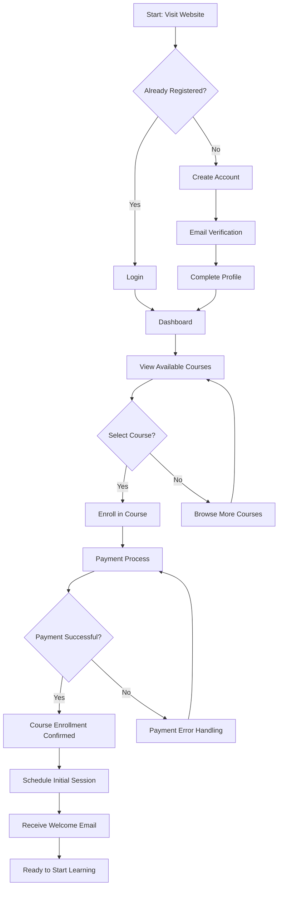

### 2. Daily Learning Session Flow

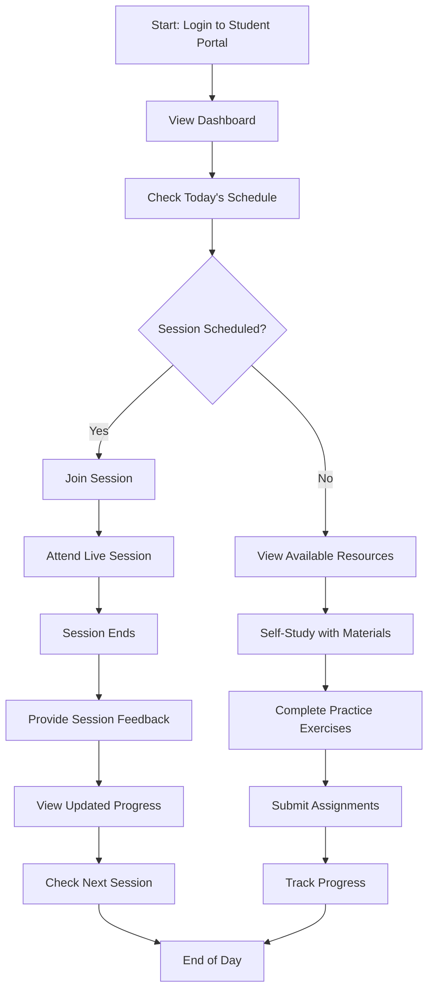

### 3. Progress Tracking Flow

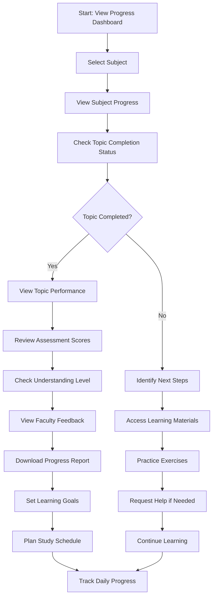

## Faculty User Flows

### 1. Daily Session Management Flow

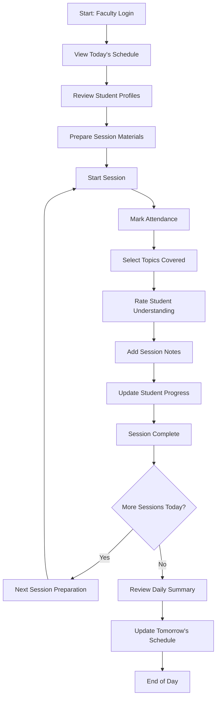

### 2. Quick Attendance Marking Flow

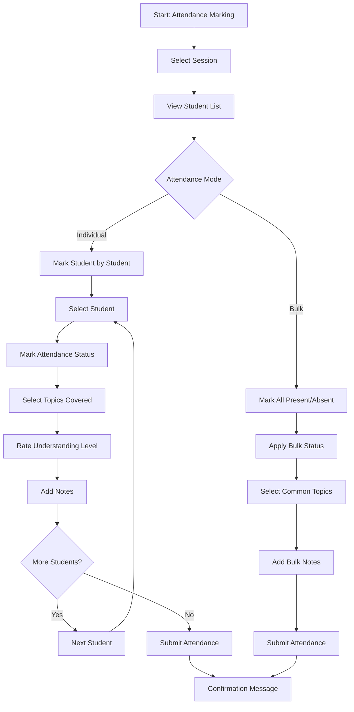

### 3. Student Progress Monitoring Flow

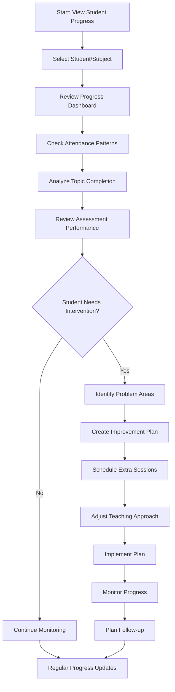

## Counselor User Flows

### 1. Lead Management Flow

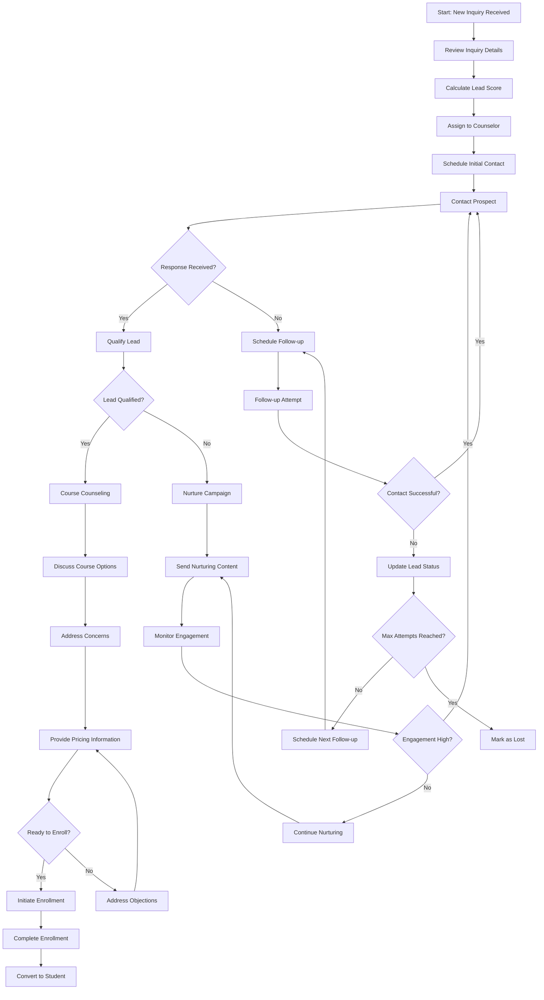

### 2. Follow-up Management Flow

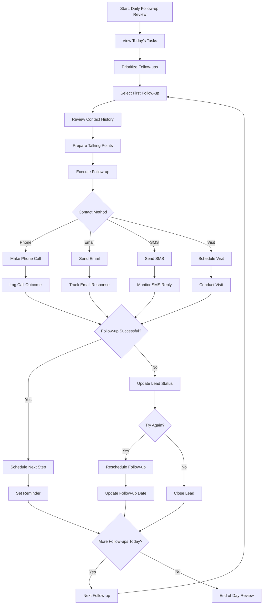

### 3. Conversion Pipeline Management Flow

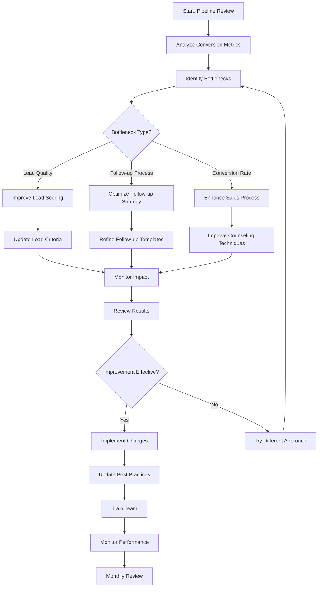

## Administrator User Flows

### 1. Institute Management Flow

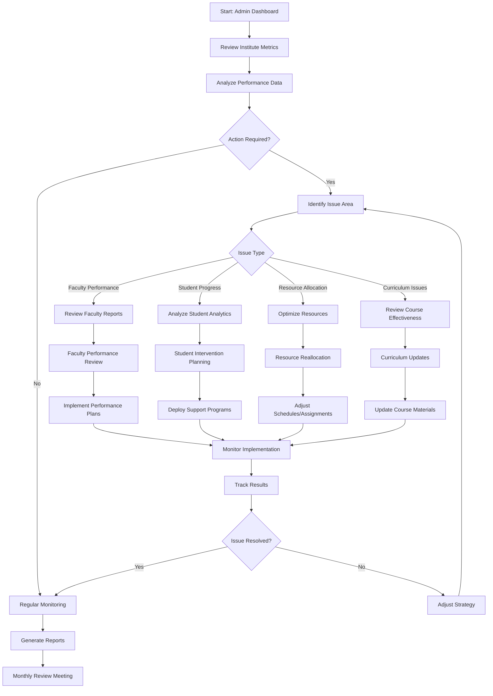

### 2. User Management Flow

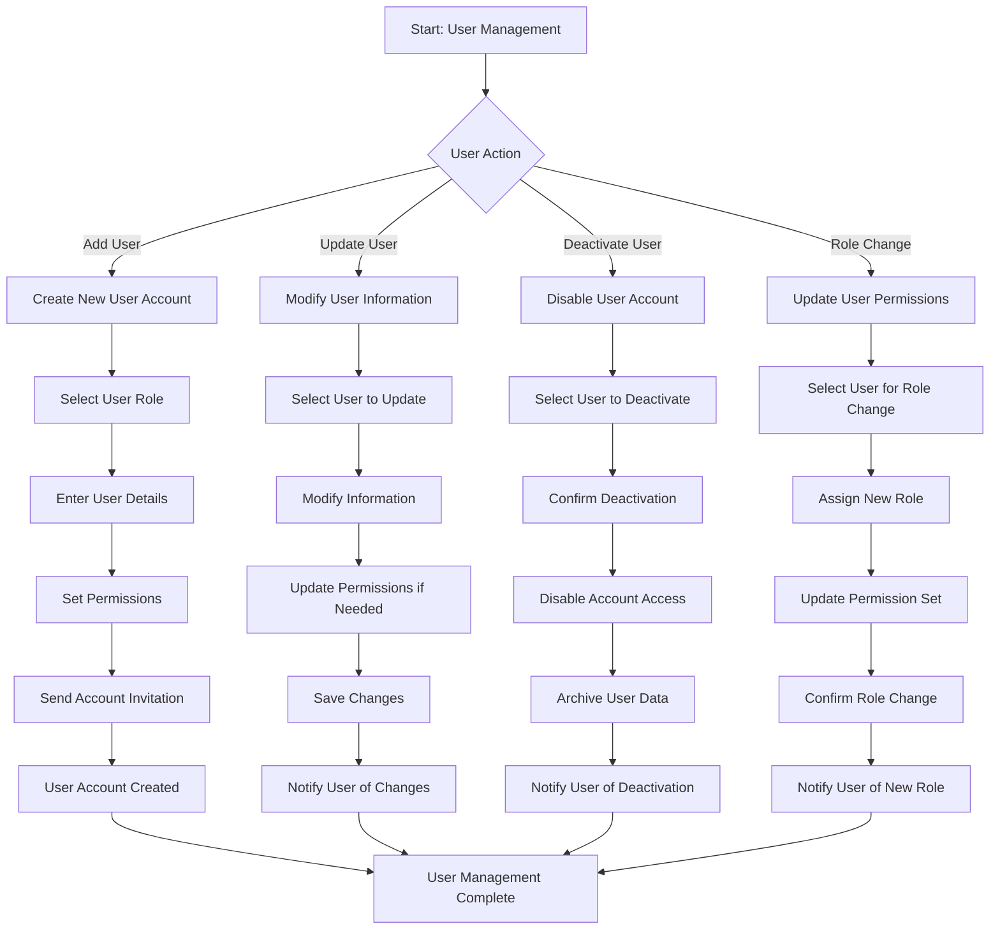

## Super Admin User Flows

### 1. System Configuration Flow

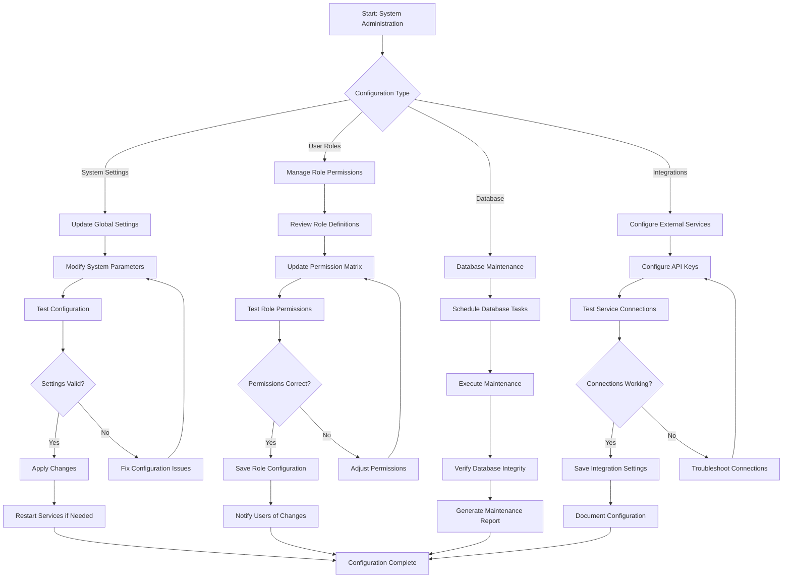

### 2. System Monitoring Flow

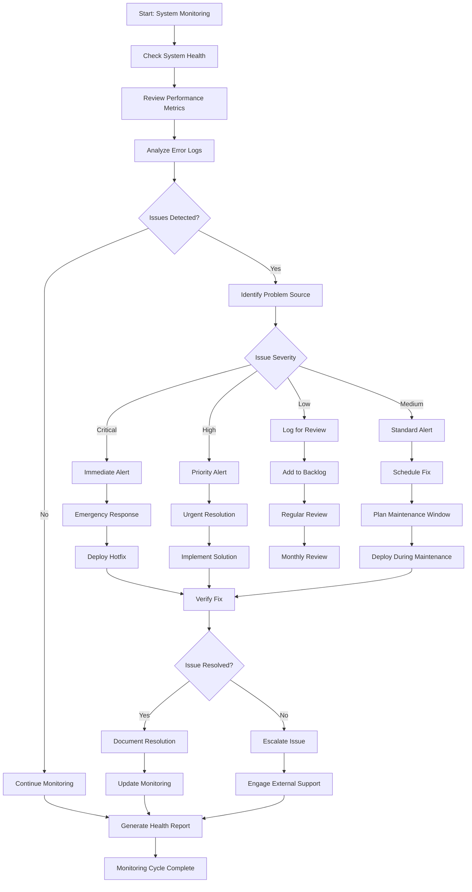

## Cross-Role Integration Flows

### 1. Student Issue Resolution Flow

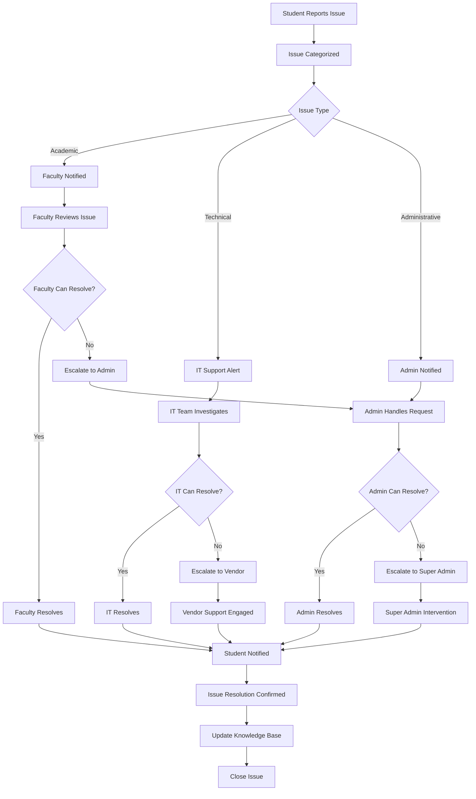

### 2. Emergency Notification Flow

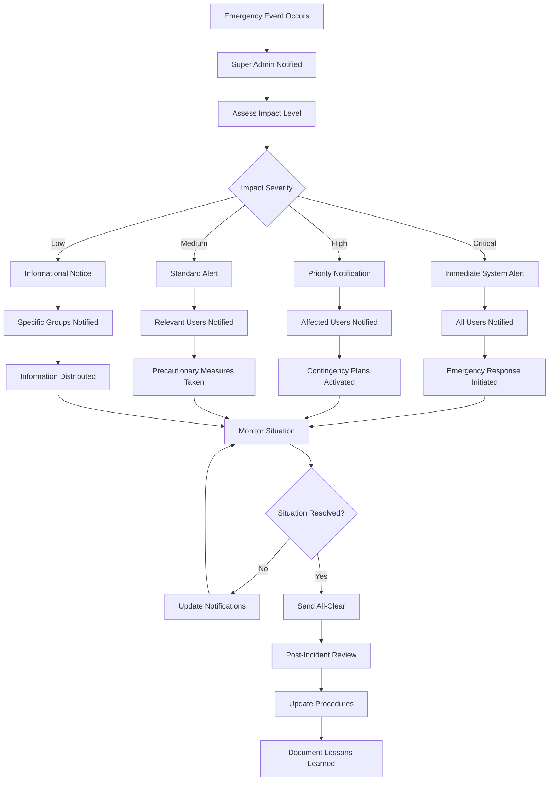

These user flow diagrams provide comprehensive coverage of all major interactions within the individual-focused learning management system, ensuring clear understanding of user journeys and decision points for each stakeholder role.