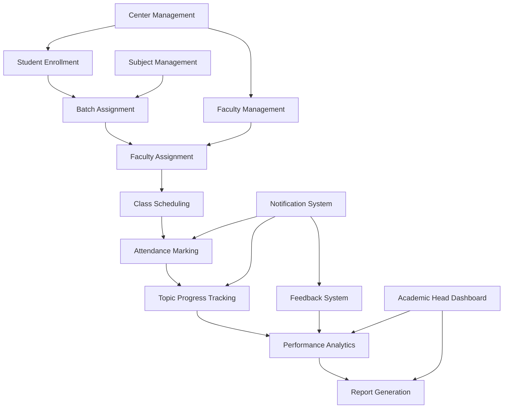
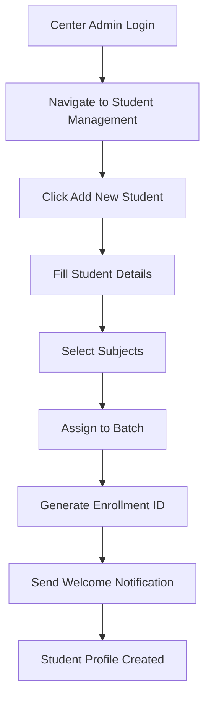
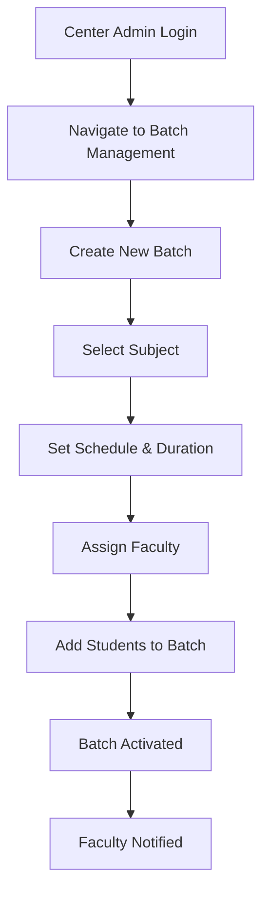
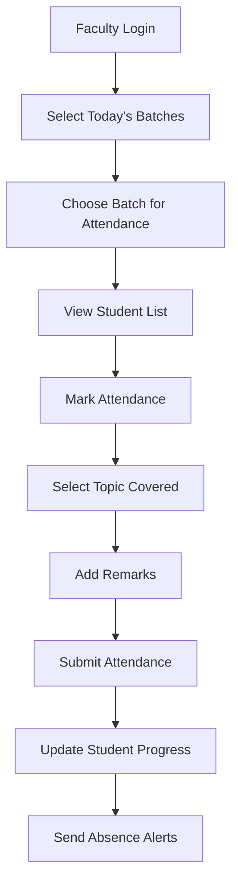
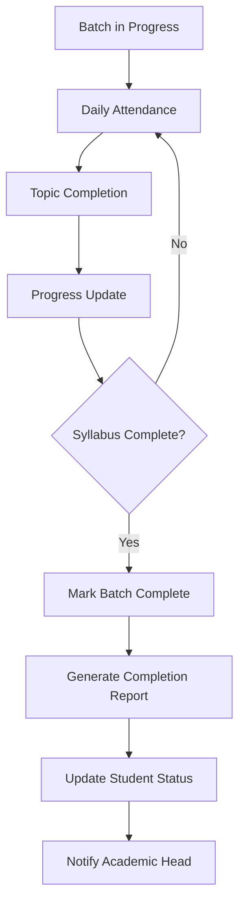
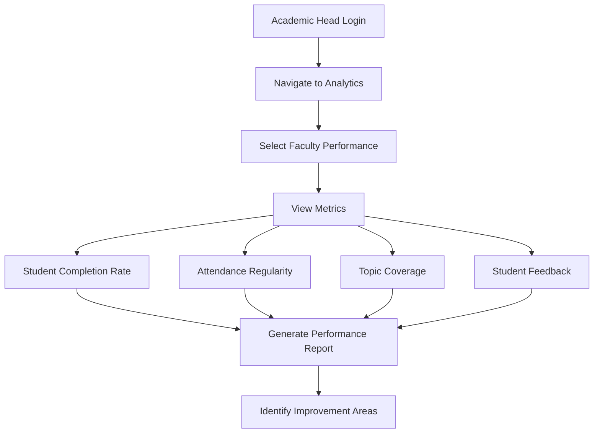
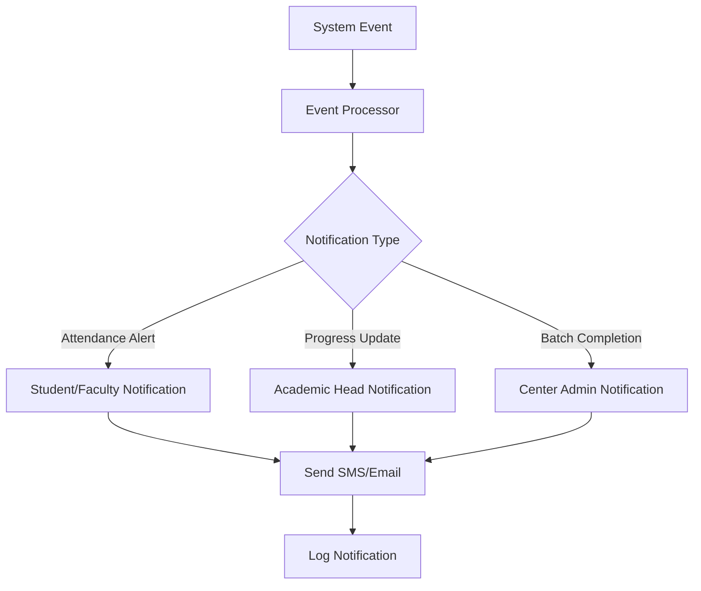

# Data Flow and User Flows Documentation

## System Data Flow Diagram



## User Flow Diagrams

### 1. Student Enrollment Flow



### 2. Faculty Batch Assignment Flow



### 3. Attendance Marking Flow



### 4. Student Progress Tracking Flow



### 5. Faculty Performance Analysis Flow



## Detailed Data Flow

### 1. Student Lifecycle Data Flow

```
Student Registration → Profile Creation → Subject Enrollment → 
Batch Assignment → Attendance Tracking → Topic Progress → 
Performance Evaluation → Completion → Certification
```

### 2. Faculty Workload Data Flow

```
Faculty Onboarding → Expertise Mapping → Batch Assignment → 
Schedule Creation → Attendance Marking → Topic Coverage → 
Progress Updates → Performance Evaluation → Feedback Collection
```

### 3. Batch Management Data Flow

```
Batch Planning → Student Enrollment → Faculty Assignment → 
Schedule Finalization → Class Execution → Attendance Tracking → 
Progress Monitoring → Syllabus Completion → Batch Closure
```

### 4. Analytics Data Flow

```
Raw Data Collection → Data Processing → Metric Calculation → 
Visualization Generation → Insight Extraction → Report Creation → 
Alert Generation → Decision Support
```

## Key Data Transformations

### 1. Attendance Analytics
- Raw attendance data → Attendance percentage → Absenteeism patterns → Alert generation
- Daily attendance → Weekly/monthly trends → Heatmap visualization

### 2. Performance Metrics
- Topic completion → Progress percentage → Learning velocity → Performance classification
- Test scores → Grade calculation → Performance trends → Comparative analysis

### 3. Faculty Utilization
- Batch assignments → Workload calculation → Efficiency metrics → Utilization reports
- Schedule data → Free time identification → Availability tracking → Optimization suggestions

## Integration Points

### 1. External Systems
- SMS Gateway for attendance alerts
- Email service for notifications
- Payment gateway for fee management (future enhancement)

### 2. Internal System Integrations
- Authentication system across all modules
- Notification system for real-time alerts
- Analytics engine for data processing

## Data Security Flow

```
User Request → Authentication → Authorization → Data Access → 
Data Processing → Response → Audit Logging
```

## Error Handling and Recovery

### 1. Attendance Marking Failures
- Offline mode support
- Data synchronization when online
- Conflict resolution for duplicate entries

### 2. Batch Schedule Conflicts
- Automatic conflict detection
- Alternative schedule suggestions
- Faculty availability validation

## Performance Optimization Flows

### 1. Data Caching Strategy
```
Request → Cache Check → Cache Hit → Return Data
Request → Cache Check → Cache Miss → Database Query → Cache Update → Return Data
```

### 2. Database Query Optimization
- Index usage for frequently accessed data
- Query result pagination for large datasets
- Connection pooling for concurrent requests

## Notification Flow



## Backup and Recovery Flow

```
Scheduled Backup → Data Extraction → Compression → 
Secure Storage → Verification → Recovery Testing
```

## Audit Trail Flow

```
User Action → Action Logging → User Identification → 
Timestamp → Data Change → Audit Record → Secure Storage
```

## Mobile App Data Flow (Future Enhancement)

```
Mobile Request → API Gateway → Authentication → 
Request Processing → Data Retrieval → Response Formatting → 
Mobile Display → Offline Storage
```

## Real-time Updates Flow

```
Data Change → Event Trigger → WebSocket Broadcast → 
Client Update → UI Refresh → User Notification
```

## Third-party Integration Flow

```
External Request → API Validation → Rate Limiting → 
Data Transformation → Internal Processing → Response Formatting → 
External Response
```

## Data Archival Flow

```
Active Data → Age Check → Archival Criteria → 
Data Migration → Archive Storage → Index Update → 
Cleanup Confirmation
```

## System Monitoring Flow

```
System Metrics → Collection Agent → Monitoring Service → 
Analysis → Alert Generation → Notification → Dashboard Update