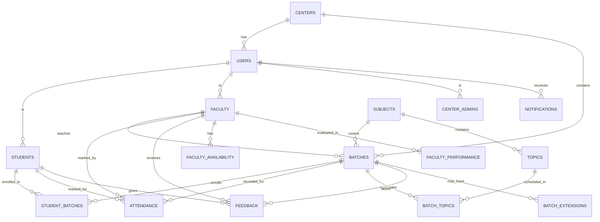

# Database Schema Design

## Entity Relationship Diagram (ERD)



## Detailed Table Definitions

### 1. CENTERS
```sql
CREATE TABLE centers (
    id SERIAL PRIMARY KEY,
    name VARCHAR(100) NOT NULL,
    code VARCHAR(20) UNIQUE NOT NULL,
    address TEXT,
    city VARCHAR(50),
    state VARCHAR(50),
    country VARCHAR(50) DEFAULT 'India',
    phone VARCHAR(20),
    email VARCHAR(100),
    status ENUM('active', 'inactive', 'suspended') DEFAULT 'active',
    created_at TIMESTAMP DEFAULT CURRENT_TIMESTAMP,
    updated_at TIMESTAMP DEFAULT CURRENT_TIMESTAMP ON UPDATE CURRENT_TIMESTAMP
);
```

### 2. USERS (Base table for all user types)
```sql
CREATE TABLE users (
    id SERIAL PRIMARY KEY,
    email VARCHAR(100) UNIQUE NOT NULL,
    password_hash VARCHAR(255) NOT NULL,
    first_name VARCHAR(50) NOT NULL,
    last_name VARCHAR(50) NOT NULL,
    phone VARCHAR(20),
    role ENUM('super_admin', 'center_admin', 'faculty', 'academic_head', 'student') NOT NULL,
    center_id INT,
    profile_image VARCHAR(255),
    last_login TIMESTAMP,
    status ENUM('active', 'inactive', 'suspended') DEFAULT 'active',
    created_at TIMESTAMP DEFAULT CURRENT_TIMESTAMP,
    updated_at TIMESTAMP DEFAULT CURRENT_TIMESTAMP ON UPDATE CURRENT_TIMESTAMP,
    FOREIGN KEY (center_id) REFERENCES centers(id) ON DELETE SET NULL
);
```

### 3. STUDENTS
```sql
CREATE TABLE students (
    user_id INT PRIMARY KEY,
    enrollment_number VARCHAR(20) UNIQUE NOT NULL,
    date_of_birth DATE,
    gender ENUM('male', 'female', 'other'),
    address TEXT,
    emergency_contact_name VARCHAR(100),
    emergency_contact_phone VARCHAR(20),
    education_background TEXT,
    previous_experience TEXT,
    enrollment_date DATE NOT NULL,
    status ENUM('active', 'completed', 'dropped', 'suspended') DEFAULT 'active',
    created_at TIMESTAMP DEFAULT CURRENT_TIMESTAMP,
    updated_at TIMESTAMP DEFAULT CURRENT_TIMESTAMP ON UPDATE CURRENT_TIMESTAMP,
    FOREIGN KEY (user_id) REFERENCES users(id) ON DELETE CASCADE
);
```

### 4. FACULTY
```sql
CREATE TABLE faculty (
    user_id INT PRIMARY KEY,
    employee_id VARCHAR(20) UNIQUE NOT NULL,
    specialization TEXT,
    qualification TEXT,
    experience_years DECIMAL(3,1),
    previous_company TEXT,
    joining_date DATE NOT NULL,
    salary DECIMAL(10,2),
    bank_details TEXT,
    status ENUM('active', 'inactive', 'on_leave') DEFAULT 'active',
    created_at TIMESTAMP DEFAULT CURRENT_TIMESTAMP,
    updated_at TIMESTAMP DEFAULT CURRENT_TIMESTAMP ON UPDATE CURRENT_TIMESTAMP,
    FOREIGN KEY (user_id) REFERENCES users(id) ON DELETE CASCADE
);
```

### 5. SUBJECTS
```sql
CREATE TABLE subjects (
    id SERIAL PRIMARY KEY,
    name VARCHAR(100) NOT NULL,
    code VARCHAR(20) UNIQUE NOT NULL,
    description TEXT,
    duration_hours INT NOT NULL,
    syllabus TEXT,
    prerequisites TEXT,
    learning_outcomes TEXT,
    status ENUM('active', 'inactive') DEFAULT 'active',
    created_at TIMESTAMP DEFAULT CURRENT_TIMESTAMP,
    updated_at TIMESTAMP DEFAULT CURRENT_TIMESTAMP ON UPDATE CURRENT_TIMESTAMP
);
```

### 6. TOPICS
```sql
CREATE TABLE topics (
    id SERIAL PRIMARY KEY,
    subject_id INT NOT NULL,
    name VARCHAR(100) NOT NULL,
    description TEXT,
    duration_hours INT NOT NULL,
    order_index INT NOT NULL,
    prerequisites TEXT,
    learning_materials TEXT,
    status ENUM('active', 'inactive') DEFAULT 'active',
    created_at TIMESTAMP DEFAULT CURRENT_TIMESTAMP,
    updated_at TIMESTAMP DEFAULT CURRENT_TIMESTAMP ON UPDATE CURRENT_TIMESTAMP,
    FOREIGN KEY (subject_id) REFERENCES subjects(id) ON DELETE CASCADE,
    UNIQUE KEY unique_topic_order (subject_id, order_index)
);
```

### 7. BATCHES
```sql
CREATE TABLE batches (
    id SERIAL PRIMARY KEY,
    name VARCHAR(100) NOT NULL,
    subject_id INT NOT NULL,
    faculty_id INT NOT NULL,
    center_id INT NOT NULL,
    start_date DATE NOT NULL,
    end_date DATE,
    schedule JSON, -- Store complex schedule as JSON
    max_students INT NOT NULL DEFAULT 30,
    current_students INT DEFAULT 0,
    status ENUM('planned', 'active', 'completed', 'suspended', 'cancelled') DEFAULT 'planned',
    created_at TIMESTAMP DEFAULT CURRENT_TIMESTAMP,
    updated_at TIMESTAMP DEFAULT CURRENT_TIMESTAMP ON UPDATE CURRENT_TIMESTAMP,
    FOREIGN KEY (subject_id) REFERENCES subjects(id),
    FOREIGN KEY (faculty_id) REFERENCES faculty(user_id),
    FOREIGN KEY (center_id) REFERENCES centers(id)
);
```

### 8. STUDENT_BATCHES
```sql
CREATE TABLE student_batches (
    id SERIAL PRIMARY KEY,
    student_id INT NOT NULL,
    batch_id INT NOT NULL,
    enrollment_date DATE NOT NULL,
    completion_date DATE,
    status ENUM('active', 'completed', 'dropped', 'transferred') DEFAULT 'active',
    progress_percentage DECIMAL(5,2) DEFAULT 0.00,
    final_grade VARCHAR(5),
    remarks TEXT,
    created_at TIMESTAMP DEFAULT CURRENT_TIMESTAMP,
    updated_at TIMESTAMP DEFAULT CURRENT_TIMESTAMP ON UPDATE CURRENT_TIMESTAMP,
    FOREIGN KEY (student_id) REFERENCES students(user_id),
    FOREIGN KEY (batch_id) REFERENCES batches(id),
    UNIQUE KEY unique_student_batch (student_id, batch_id)
);
```

### 9. ATTENDANCE
```sql
CREATE TABLE attendance (
    id SERIAL PRIMARY KEY,
    student_id INT NOT NULL,
    batch_id INT NOT NULL,
    faculty_id INT NOT NULL,
    date DATE NOT NULL,
    status ENUM('present', 'absent', 'late', 'excused') NOT NULL,
    topic_covered TEXT,
    remarks TEXT,
    marked_at TIMESTAMP DEFAULT CURRENT_TIMESTAMP,
    updated_at TIMESTAMP DEFAULT CURRENT_TIMESTAMP ON UPDATE CURRENT_TIMESTAMP,
    FOREIGN KEY (student_id) REFERENCES students(user_id),
    FOREIGN KEY (batch_id) REFERENCES batches(id),
    FOREIGN KEY (faculty_id) REFERENCES faculty(user_id),
    UNIQUE KEY unique_attendance (student_id, batch_id, date)
);
```

### 10. BATCH_TOPICS
```sql
CREATE TABLE batch_topics (
    id SERIAL PRIMARY KEY,
    batch_id INT NOT NULL,
    topic_id INT NOT NULL,
    scheduled_date DATE,
    completed_date DATE,
    faculty_id INT NOT NULL,
    status ENUM('pending', 'in_progress', 'completed', 'skipped') DEFAULT 'pending',
    notes TEXT,
    created_at TIMESTAMP DEFAULT CURRENT_TIMESTAMP,
    updated_at TIMESTAMP DEFAULT CURRENT_TIMESTAMP ON UPDATE CURRENT_TIMESTAMP,
    FOREIGN KEY (batch_id) REFERENCES batches(id) ON DELETE CASCADE,
    FOREIGN KEY (topic_id) REFERENCES topics(id),
    FOREIGN KEY (faculty_id) REFERENCES faculty(user_id),
    UNIQUE KEY unique_batch_topic (batch_id, topic_id)
);
```

### 11. FEEDBACK
```sql
CREATE TABLE feedback (
    id SERIAL PRIMARY KEY,
    student_id INT NOT NULL,
    faculty_id INT NOT NULL,
    batch_id INT NOT NULL,
    rating INT NOT NULL CHECK (rating >= 1 AND rating <= 5),
    comments TEXT,
    feedback_type ENUM('faculty', 'course', 'batch', 'overall') NOT NULL,
    is_anonymous BOOLEAN DEFAULT FALSE,
    status ENUM('pending', 'reviewed', 'resolved') DEFAULT 'pending',
    created_at TIMESTAMP DEFAULT CURRENT_TIMESTAMP,
    updated_at TIMESTAMP DEFAULT CURRENT_TIMESTAMP ON UPDATE CURRENT_TIMESTAMP,
    FOREIGN KEY (student_id) REFERENCES students(user_id),
    FOREIGN KEY (faculty_id) REFERENCES faculty(user_id),
    FOREIGN KEY (batch_id) REFERENCES batches(id)
);
```

### 12. NOTIFICATIONS
```sql
CREATE TABLE notifications (
    id SERIAL PRIMARY KEY,
    user_id INT NOT NULL,
    title VARCHAR(200) NOT NULL,
    message TEXT NOT NULL,
    type ENUM('info', 'warning', 'error', 'success') NOT NULL,
    category ENUM('attendance', 'progress', 'batch', 'feedback', 'system') NOT NULL,
    related_id INT, -- Can reference batch_id, student_id, etc.
    is_read BOOLEAN DEFAULT FALSE,
    read_at TIMESTAMP NULL,
    created_at TIMESTAMP DEFAULT CURRENT_TIMESTAMP,
    FOREIGN KEY (user_id) REFERENCES users(id) ON DELETE CASCADE
);
```

### 13. BATCH_EXTENSIONS
```sql
CREATE TABLE batch_extensions (
    id SERIAL PRIMARY KEY,
    batch_id INT NOT NULL,
    original_end_date DATE NOT NULL,
    new_end_date DATE NOT NULL,
    reason TEXT,
    requested_by INT NOT NULL, -- faculty_id or center_admin_id
    approved_by INT,
    status ENUM('pending', 'approved', 'rejected') DEFAULT 'pending',
    created_at TIMESTAMP DEFAULT CURRENT_TIMESTAMP,
    updated_at TIMESTAMP DEFAULT CURRENT_TIMESTAMP ON UPDATE CURRENT_TIMESTAMP,
    FOREIGN KEY (batch_id) REFERENCES batches(id),
    FOREIGN KEY (requested_by) REFERENCES users(id),
    FOREIGN KEY (approved_by) REFERENCES users(id)
);
```

### 14. FACULTY_AVAILABILITY
```sql
CREATE TABLE faculty_availability (
    id SERIAL PRIMARY KEY,
    faculty_id INT NOT NULL,
    date DATE NOT NULL,
    start_time TIME NOT NULL,
    end_time TIME NOT NULL,
    status ENUM('available', 'busy', 'on_leave') NOT NULL,
    remarks TEXT,
    created_at TIMESTAMP DEFAULT CURRENT_TIMESTAMP,
    updated_at TIMESTAMP DEFAULT CURRENT_TIMESTAMP ON UPDATE CURRENT_TIMESTAMP,
    FOREIGN KEY (faculty_id) REFERENCES faculty(user_id)
);
```

### 15. FACULTY_PERFORMANCE
```sql
CREATE TABLE faculty_performance (
    id SERIAL PRIMARY KEY,
    faculty_id INT NOT NULL,
    evaluation_period VARCHAR(20) NOT NULL, -- e.g., '2023-10', 'Q4-2023'
    total_students_taught INT DEFAULT 0,
    students_completed INT DEFAULT 0,
    average_completion_rate DECIMAL(5,2),
    average_feedback_rating DECIMAL(3,2),
    total_classes_taken INT DEFAULT 0,
    attendance_percentage DECIMAL(5,2),
    punctuality_score DECIMAL(5,2),
    syllabus_coverage_percentage DECIMAL(5,2),
    overall_score DECIMAL(5,2),
    created_at TIMESTAMP DEFAULT CURRENT_TIMESTAMP,
    updated_at TIMESTAMP DEFAULT CURRENT_TIMESTAMP ON UPDATE CURRENT_TIMESTAMP,
    FOREIGN KEY (faculty_id) REFERENCES faculty(user_id)
);
```

## Indexes for Performance Optimization

```sql
-- User and Authentication Indexes
CREATE INDEX idx_users_email ON users(email);
CREATE INDEX idx_users_role ON users(role);
CREATE INDEX idx_users_center_id ON users(center_id);

-- Student Indexes
CREATE INDEX idx_students_enrollment_number ON students(enrollment_number);
CREATE INDEX idx_students_status ON students(status);

-- Faculty Indexes
CREATE INDEX idx_faculty_employee_id ON faculty(employee_id);
CREATE INDEX idx_faculty_specialization ON faculty(specialization(100));

-- Batch Indexes
CREATE INDEX idx_batches_subject_id ON batches(subject_id);
CREATE INDEX idx_batches_faculty_id ON batches(faculty_id);
CREATE INDEX idx_batches_center_id ON batches(center_id);
CREATE INDEX idx_batches_status ON batches(status);
CREATE INDEX idx_batches_dates ON batches(start_date, end_date);

-- Attendance Indexes
CREATE INDEX idx_attendance_student_id ON attendance(student_id);
CREATE INDEX idx_attendance_batch_id ON attendance(batch_id);
CREATE INDEX idx_attendance_date ON attendance(date);
CREATE INDEX idx_attendance_status ON attendance(status);

-- Student Batch Indexes
CREATE INDEX idx_student_batches_student_id ON student_batches(student_id);
CREATE INDEX idx_student_batches_batch_id ON student_batches(batch_id);
CREATE INDEX idx_student_batches_status ON student_batches(status);

-- Feedback Indexes
CREATE INDEX idx_feedback_student_id ON feedback(student_id);
CREATE INDEX idx_feedback_faculty_id ON feedback(faculty_id);
CREATE INDEX idx_feedback_batch_id ON feedback(batch_id);
CREATE INDEX idx_feedback_rating ON feedback(rating);

-- Notification Indexes
CREATE INDEX idx_notifications_user_id ON notifications(user_id);
CREATE INDEX idx_notifications_is_read ON notifications(is_read);
CREATE INDEX idx_notifications_created_at ON notifications(created_at);

-- Performance Indexes
CREATE INDEX idx_faculty_performance_faculty_id ON faculty_performance(faculty_id);
CREATE INDEX idx_faculty_performance_period ON faculty_performance(evaluation_period);
```

## Database Views for Complex Queries

### 1. Student Progress View
```sql
CREATE VIEW student_progress_view AS
SELECT 
    s.user_id,
    s.enrollment_number,
    CONCAT(u.first_name, ' ', u.last_name) AS student_name,
    sb.batch_id,
    b.name AS batch_name,
    sub.name AS subject_name,
    sb.progress_percentage,
    sb.status AS batch_status,
    COUNT(a.id) AS total_classes,
    COUNT(CASE WHEN a.status = 'present' THEN 1 END) AS classes_attended,
    ROUND(COUNT(CASE WHEN a.status = 'present' THEN 1 END) * 100.0 / COUNT(a.id), 2) AS attendance_percentage
FROM students s
JOIN users u ON s.user_id = u.id
JOIN student_batches sb ON s.user_id = sb.student_id
JOIN batches b ON sb.batch_id = b.id
JOIN subjects sub ON b.subject_id = sub.id
LEFT JOIN attendance a ON s.user_id = a.student_id AND b.id = a.batch_id
GROUP BY s.user_id, s.enrollment_number, student_name, sb.batch_id, b.name, sub.name, sb.progress_percentage, sb.status;
```

### 2. Faculty Performance View
```sql
CREATE VIEW faculty_performance_summary AS
SELECT 
    f.user_id,
    f.employee_id,
    CONCAT(u.first_name, ' ', u.last_name) AS faculty_name,
    COUNT(DISTINCT b.id) AS total_batches,
    COUNT(DISTINCT sb.student_id) AS total_students_taught,
    COUNT(DISTINCT CASE WHEN sb.status = 'completed' THEN sb.student_id END) AS students_completed,
    ROUND(AVG(fb.rating), 2) AS average_feedback_rating,
    COUNT(a.id) AS total_classes_taken,
    ROUND(AVG(CASE WHEN a.status = 'present' THEN 1 ELSE 0 END) * 100, 2) AS student_attendance_rate
FROM faculty f
JOIN users u ON f.user_id = u.id
LEFT JOIN batches b ON f.user_id = b.faculty_id
LEFT JOIN student_batches sb ON b.id = sb.batch_id
LEFT JOIN feedback fb ON f.user_id = fb.faculty_id
LEFT JOIN attendance a ON f.user_id = a.faculty_id
GROUP BY f.user_id, f.employee_id, faculty_name;
```

### 3. Batch Analytics View
```sql
CREATE VIEW batch_analytics_view AS
SELECT 
    b.id,
    b.name,
    b.start_date,
    b.end_date,
    b.status,
    sub.name AS subject_name,
    CONCAT(fac.first_name, ' ', fac.last_name) AS faculty_name,
    c.name AS center_name,
    COUNT(sb.student_id) AS enrolled_students,
    COUNT(CASE WHEN sb.status = 'completed' THEN 1 END) AS completed_students,
    COUNT(CASE WHEN sb.status = 'active' THEN 1 END) AS active_students,
    ROUND(AVG(sb.progress_percentage), 2) AS average_progress,
    COUNT(a.id) AS total_classes,
    ROUND(AVG(CASE WHEN a.status = 'present' THEN 1 ELSE 0 END) * 100, 2) AS average_attendance
FROM batches b
JOIN subjects sub ON b.subject_id = sub.id
JOIN faculty fac ON b.faculty_id = fac.user_id
JOIN users u ON fac.user_id = u.id
JOIN centers c ON b.center_id = c.id
LEFT JOIN student_batches sb ON b.id = sb.batch_id
LEFT JOIN attendance a ON b.id = a.batch_id
GROUP BY b.id, b.name, b.start_date, b.end_date, b.status, sub.name, faculty_name, c.name;
```

## Stored Procedures for Common Operations

### 1. Mark Attendance Procedure
```sql
DELIMITER //
CREATE PROCEDURE MarkAttendance(
    IN p_student_id INT,
    IN p_batch_id INT,
    IN p_faculty_id INT,
    IN p_date DATE,
    IN p_status VARCHAR(20),
    IN p_topic_covered TEXT,
    IN p_remarks TEXT
)
BEGIN
    DECLARE v_attendance_id INT;
    
    -- Check if attendance already exists
    SELECT id INTO v_attendance_id 
    FROM attendance 
    WHERE student_id = p_student_id AND batch_id = p_batch_id AND date = p_date;
    
    IF v_attendance_id IS NOT NULL THEN
        -- Update existing attendance
        UPDATE attendance 
        SET status = p_status, topic_covered = p_topic_covered, remarks = p_remarks, updated_at = CURRENT_TIMESTAMP
        WHERE id = v_attendance_id;
    ELSE
        -- Insert new attendance
        INSERT INTO attendance (student_id, batch_id, faculty_id, date, status, topic_covered, remarks)
        VALUES (p_student_id, p_batch_id, p_faculty_id, p_date, p_status, p_topic_covered, p_remarks);
    END IF;
    
    -- Update student batch progress if needed
    CALL UpdateStudentProgress(p_student_id, p_batch_id);
    
    -- Create notification for absence
    IF p_status = 'absent' THEN
        INSERT INTO notifications (user_id, title, message, type, category, related_id)
        VALUES (
            p_student_id, 
            'Attendance Marked', 
            CONCAT('You were marked absent on ', p_date), 
            'warning', 
            'attendance', 
            p_batch_id
        );
    END IF;
END //
DELIMITER ;
```

### 2. Update Student Progress Procedure
```sql
DELIMITER //
CREATE PROCEDURE UpdateStudentProgress(
    IN p_student_id INT,
    IN p_batch_id INT
)
BEGIN
    DECLARE v_total_topics INT DEFAULT 0;
    DECLARE v_completed_topics INT DEFAULT 0;
    DECLARE v_progress DECIMAL(5,2) DEFAULT 0.00;
    
    -- Get total and completed topics for the batch
    SELECT COUNT(*) INTO v_total_topics
    FROM batch_topics bt
    JOIN topics t ON bt.topic_id = t.id
    WHERE bt.batch_id = p_batch_id AND t.status = 'active';
    
    SELECT COUNT(*) INTO v_completed_topics
    FROM batch_topics bt
    WHERE bt.batch_id = p_batch_id AND bt.status = 'completed';
    
    -- Calculate progress percentage
    IF v_total_topics > 0 THEN
        SET v_progress = (v_completed_topics * 100.0) / v_total_topics;
    END IF;
    
    -- Update student batch progress
    UPDATE student_batches 
    SET progress_percentage = v_progress, updated_at = CURRENT_TIMESTAMP
    WHERE student_id = p_student_id AND batch_id = p_batch_id;
    
    -- Check if batch is complete
    IF v_progress >= 100 THEN
        UPDATE student_batches 
        SET status = 'completed', completion_date = CURRENT_DATE
        WHERE student_id = p_student_id AND batch_id = p_batch_id AND status = 'active';
    END IF;
END //
DELIMITER ;
```

## Triggers for Data Integrity

### 1. Update Batch Student Count Trigger
```sql
DELIMITER //
CREATE TRIGGER update_batch_student_count
AFTER INSERT ON student_batches
FOR EACH ROW
BEGIN
    UPDATE batches 
    SET current_students = (
        SELECT COUNT(*) FROM student_batches WHERE batch_id = NEW.batch_id AND status = 'active'
    )
    WHERE id = NEW.batch_id;
END //
DELIMITER ;

DELIMITER //
CREATE TRIGGER update_batch_student_count_delete
AFTER UPDATE ON student_batches
FOR EACH ROW
BEGIN
    IF OLD.status != NEW.status THEN
        UPDATE batches 
        SET current_students = (
            SELECT COUNT(*) FROM student_batches WHERE batch_id = NEW.batch_id AND status = 'active'
        )
        WHERE id = NEW.batch_id;
    END IF;
END //
DELIMITER ;
```

### 2. Audit Log Trigger
```sql
DELIMITER //
CREATE TRIGGER audit_attendance_changes
AFTER UPDATE ON attendance
FOR EACH ROW
BEGIN
    IF OLD.status != NEW.status THEN
        INSERT INTO notifications (user_id, title, message, type, category, related_id)
        VALUES (
            NEW.student_id,
            'Attendance Updated',
            CONCAT('Your attendance for ', NEW.date, ' was updated from ', OLD.status, ' to ', NEW.status),
            'info',
            'attendance',
            NEW.batch_id
        );
    END IF;
END //
DELIMITER ;